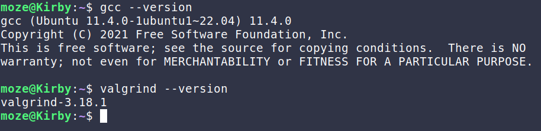
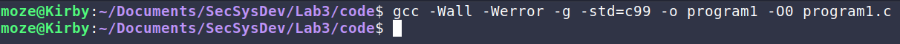
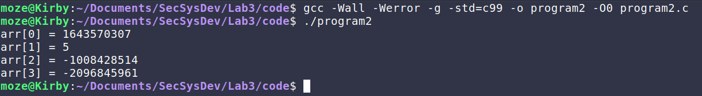
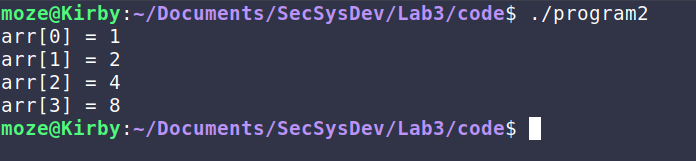
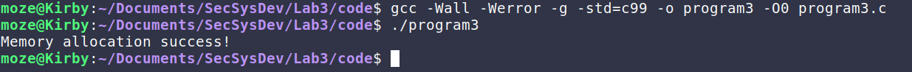
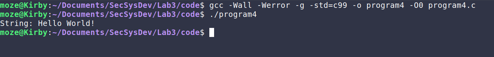
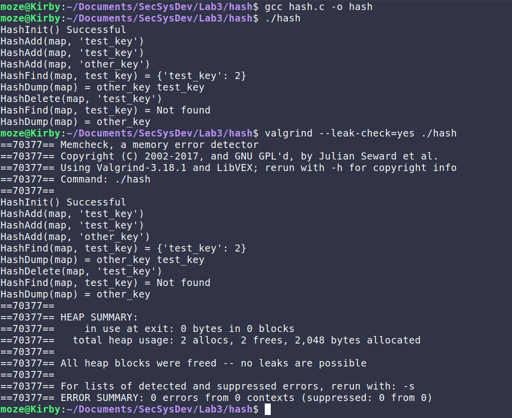

## Programs Analysis

All the code for the programs used for this lab are on my [GitHub]()

### Installing tools



### Program 1

- **Compiling the code & explaining the flags**

	

	According to the man page of [`gcc`](https://man7.org/linux/man-pages/man1/gcc.1.html):
	- `-Wall`: Enables all the warnings about constructions that some users consider questionable, and that are easy to avoid. 
	- `-Werror`: Make all warnings into errors.
	- `g`: Produce debugging information in the operating system's native format.
	- `-std=c99`: Determine the language standard, in this case [`c99`](https://en.wikipedia.org/wiki/C99) which is a past version of the C programming language open standard
	- `-o`: Place the output in the file specified
	- `-O0`: Reduce compilation time and make debugging produce the expected results.

- **Running the program**
	
	The output seems to be normal
- **Running the program with `valgrind`**
	```bash
	$ valgrind --leak-check=yes ./program1 
	==124505== Memcheck, a memory error detector
	==124505== Copyright (C) 2002-2017, and GNU GPL'd, by Julian Seward et al.
	==124505== Using Valgrind-3.18.1 and LibVEX; rerun with -h for copyright info
	==124505== Command: ./program1
	==124505== 
	arr[0] = 0
	==124505== Invalid write of size 4
	==124505==    at 0x1091AC: program1 (program1.c:12)
	==124505==    by 0x1091FE: main (program1.c:23)
	==124505==  Address 0x4aa6044 is 0 bytes after a block of size 4 alloc'd
	==124505==    at 0x4848899: malloc (in /usr/libexec/valgrind/vgpreload_memcheck-amd64-linux.so)
	==124505==    by 0x109184: program1 (program1.c:8)
	==124505==    by 0x1091FE: main (program1.c:23)
	==124505== 
	==124505== Invalid read of size 4
	==124505==    at 0x1091C2: program1 (program1.c:14)
	==124505==    by 0x1091FE: main (program1.c:23)
	==124505==  Address 0x4aa6044 is 0 bytes after a block of size 4 alloc'd
	==124505==    at 0x4848899: malloc (in /usr/libexec/valgrind/vgpreload_memcheck-amd64-linux.so)
	==124505==    by 0x109184: program1 (program1.c:8)
	==124505==    by 0x1091FE: main (program1.c:23)
	==124505== 
	arr[1] = 1
	arr[2] = 4
	arr[3] = 9
	==124505== 
	==124505== HEAP SUMMARY:
	==124505==     in use at exit: 4 bytes in 1 blocks
	==124505==   total heap usage: 2 allocs, 1 frees, 1,028 bytes allocated
	==124505== 
	==124505== 4 bytes in 1 blocks are definitely lost in loss record 1 of 1
	==124505==    at 0x4848899: malloc (in /usr/libexec/valgrind/vgpreload_memcheck-amd64-linux.so)
	==124505==    by 0x109184: program1 (program1.c:8)
	==124505==    by 0x1091FE: main (program1.c:23)
	==124505== 
	==124505== LEAK SUMMARY:
	==124505==    definitely lost: 4 bytes in 1 blocks
	==124505==    indirectly lost: 0 bytes in 0 blocks
	==124505==      possibly lost: 0 bytes in 0 blocks
	==124505==    still reachable: 0 bytes in 0 blocks
	==124505==         suppressed: 0 bytes in 0 blocks
	==124505== 
	==124505== For lists of detected and suppressed errors, rerun with: -s
	==124505== ERROR SUMMARY: 7 errors from 3 contexts (suppressed: 0 from 0)
	```
- **Explaining the output**
	In the output we notice that we got 3 problems:
	- **Invalid write:** The program is trying to write into an invalid memory location.  This is considered to be [CWE-787: Out-of-bounds Write](https://cwe.mitre.org/data/definitions/787.html).
	- **Invalid read:** Similar to write, the program is trying to read from an invalid memory location. And this is considered to be [CWE-125: Out-of-bounds Read](https://cwe.mitre.org/data/definitions/125.html).
	- **Leaks:** The report also says that we lost 4 bytes, which means that the code has a memory leak. This can be considered to be [CWE-401: Missing Release of Memory after Effective Lifetime](https://cwe.mitre.org/data/definitions/401.html).
- **Fixes & Verification**
	To fix the first 2 problems we have to initialize our memory properly, we notice in the code that we are using: `malloc(N)` where `N` is 4, but we are filling the array with `int` values.
	For the 3rd problem, we simply have to free pointers that we are done using.
	```bash
	$ valgrind --leak-check=yes ./program1 
	==138965== Memcheck, a memory error detector
	==138965== Copyright (C) 2002-2017, and GNU GPL'd, by Julian Seward et al.
	==138965== Using Valgrind-3.18.1 and LibVEX; rerun with -h for copyright info
	==138965== Command: ./program1
	==138965== 
	arr[0] = 0
	arr[1] = 1
	arr[2] = 4
	arr[3] = 9
	==138965== 
	==138965== HEAP SUMMARY:
	==138965==     in use at exit: 0 bytes in 0 blocks
	==138965==   total heap usage: 2 allocs, 2 frees, 1,040 bytes allocated
	==138965== 
	==138965== All heap blocks were freed -- no leaks are possible
	==138965== 
	==138965== For lists of detected and suppressed errors, rerun with: -s
	==138965== ERROR SUMMARY: 0 errors from 0 contexts (suppressed: 0 from 0)
	```

### Program 2

- **Running the program**

	
	There output doesn't seem to be normal, since the program was supposed to output the numbers 1, 2, 4 and 8.

- **Running the program with `valgrind`**
	```bash
	$ valgrind --leak-check=yes ./program2
	==141891== Memcheck, a memory error detector
	==141891== Copyright (C) 2002-2017, and GNU GPL'd, by Julian Seward et al.
	==141891== Using Valgrind-3.18.1 and LibVEX; rerun with -h for copyright info
	==141891== Command: ./program2
	==141891== 
	==141891== Invalid read of size 4
	==141891==    at 0x10927E: program2 (program2.c:33)
	==141891==    by 0x1092BA: main (program2.c:42)
	==141891==  Address 0x4aa6040 is 0 bytes inside a block of size 16 free'd
	==141891==    at 0x484B27F: free (in /usr/libexec/valgrind/vgpreload_memcheck-amd64-linux.so)
	==141891==    by 0x10920A: work (program2.c:16)
	==141891==    by 0x109260: program2 (program2.c:29)
	==141891==    by 0x1092BA: main (program2.c:42)
	==141891==  Block was alloc'd at
	==141891==    at 0x4848899: malloc (in /usr/libexec/valgrind/vgpreload_memcheck-amd64-linux.so)
	==141891==    by 0x10922B: program2 (program2.c:23)
	==141891==    by 0x1092BA: main (program2.c:42)
	==141891== 
	arr[0] = 1
	arr[1] = 2
	arr[2] = 4
	arr[3] = 8
	==141891== 
	==141891== HEAP SUMMARY:
	==141891==     in use at exit: 0 bytes in 0 blocks
	==141891==   total heap usage: 2 allocs, 2 frees, 1,040 bytes allocated
	==141891== 
	==141891== All heap blocks were freed -- no leaks are possible
	==141891== 
	==141891== For lists of detected and suppressed errors, rerun with: -s
	==141891== ERROR SUMMARY: 4 errors from 1 contexts (suppressed: 0 from 0)
	```
- **Explaining the output**
	- **Invalid read:** The output show that the program was trying to read from an invalid memory location. This could be considered:
		- [CWE-416: Use After Free](https://cwe.mitre.org/data/definitions/416.html)
		- [CWE-125: Out-of-bounds Read](https://cwe.mitre.org/data/definitions/125.html).
- **Fixes & Verification**
	Upon examining the code and the report more, we notice that we are freeing the pointer `arr` inside of the function `work()` and then we are trying to access it inside of after `work()` finishes execution. 
	To solve such problem we just have to move the `free()` to a proper place.
	

	```bash
	$ valgrind --leak-check=yes ./program2
	==149198== Memcheck, a memory error detector
	==149198== Copyright (C) 2002-2017, and GNU GPL'd, by Julian Seward et al.
	==149198== Using Valgrind-3.18.1 and LibVEX; rerun with -h for copyright info
	==149198== Command: ./program2
	==149198== 
	arr[0] = 1
	arr[1] = 2
	arr[2] = 4
	arr[3] = 8
	==149198== 
	==149198== HEAP SUMMARY:
	==149198==     in use at exit: 0 bytes in 0 blocks
	==149198==   total heap usage: 2 allocs, 2 frees, 1,040 bytes allocated
	==149198== 
	==149198== All heap blocks were freed -- no leaks are possible
	==149198== 
	==149198== For lists of detected and suppressed errors, rerun with: -s
	==149198== ERROR SUMMARY: 0 errors from 0 contexts (suppressed: 0 from 0)
	```

### Program 3

- **Running the program**

	

- **Running the program with `valgrind`**
	```bash
	$ valgrind --leak-check=yes ./program3
	==159260== Memcheck, a memory error detector
	==159260== Copyright (C) 2002-2017, and GNU GPLd, by Julian Seward et al.
	==159260== Using Valgrind-3.18.1 and LibVEX; rerun with -h for copyright info
	==159260== Command: ./program3
	==159260== 
	Memory allocation success!
	==159260== 
	==159260== HEAP SUMMARY:
	==159260==     in use at exit: 4 bytes in 1 blocks
	==159260==   total heap usage: 2 allocs, 1 frees, 1,028 bytes allocated
	==159260== 
	==159260== 4 bytes in 1 blocks are definitely lost in loss record 1 of 1
	==159260==    at 0x4848899: malloc (in /usr/libexec/valgrind/vgpreload_memcheck-amd64-linux.so)
	==159260==    by 0x1091A2: program3 (program3.c:10)
	==159260==    by 0x1091FC: main (program3.c:29)
	==159260== 
	==159260== LEAK SUMMARY:
	==159260==    definitely lost: 4 bytes in 1 blocks
	==159260==    indirectly lost: 0 bytes in 0 blocks
	==159260==      possibly lost: 0 bytes in 0 blocks
	==159260==    still reachable: 0 bytes in 0 blocks
	==159260==         suppressed: 0 bytes in 0 blocks
	==159260== 
	==159260== For lists of detected and suppressed errors, rerun with: -s
	==159260== ERROR SUMMARY: 1 errors from 1 contexts (suppressed: 0 from 0)
	```
- **Explaining the output**
	The output show that there have been a memory leak in the program, since we had 2 allocations and only one of them got freed. This is a  [CWE-401: Missing Release of Memory after Effective Lifetime](https://cwe.mitre.org/data/definitions/401.html).
- **Fixes & Verification**
	From the report we can see that there have been 2 allocations, one inside the function `program3()` and the other inside `main()`. If we look closely we can notice that inside of the `if-statment` in `program3()` we are assigning a `Null` value to our pointer, before we free it, making it impossible for us to gain access to the old address, and causing a memory leak. 
	To avoid that we should change it to `(arr == NULL)`. 
	The same applies  if the condition inside the `program3()` function is met, we will face the same problem since we are returning `NULL` and assigning it to the `arr` in `main()`. That's why we have to make sure that we free the pointer before returning `NULL`
	```bash
	$ valgrind --leak-check=yes ./program3
	==188933== Memcheck, a memory error detector
	==188933== Copyright (C) 2002-2017, and GNU GPL'd, by Julian Seward et al.
	==188933== Using Valgrind-3.18.1 and LibVEX; rerun with -h for copyright info
	==188933== Command: ./program3
	==188933== 
	Memory allocation success!
	==188933== 
	==188933== HEAP SUMMARY:
	==188933==     in use at exit: 0 bytes in 0 blocks
	==188933==   total heap usage: 2 allocs, 2 frees, 1,028 bytes allocated
	==188933== 
	==188933== All heap blocks were freed -- no leaks are possible
	==188933== 
	==188933== For lists of detected and suppressed errors, rerun with: -s
	==188933== ERROR SUMMARY: 0 errors from 0 contexts (suppressed: 0 from 0)
	```

### Program 4

- **Running the program**

	

- **Running the program with `valgrind`**
	```bash
	$ valgrind --leak-check=yes ./program4
	==191357== Memcheck, a memory error detector
	==191357== Copyright (C) 2002-2017, and GNU GPL'd, by Julian Seward et al.
	==191357== Using Valgrind-3.18.1 and LibVEX; rerun with -h for copyright info
	==191357== Command: ./program4
	==191357== 
	==191357== Conditional jump or move depends on uninitialised value(s)
	==191357==    at 0x484ED19: strlen (in /usr/libexec/valgrind/vgpreload_memcheck-amd64-linux.so)
	==191357==    by 0x48F0D30: __vfprintf_internal (vfprintf-internal.c:1517)
	==191357==    by 0x48DA79E: printf (printf.c:33)
	==191357==    by 0x10923C: program4 (program4.c:21)
	==191357==    by 0x109251: main (program4.c:28)
	==191357== 
	==191357== Conditional jump or move depends on uninitialised value(s)
	==191357==    at 0x484ED28: strlen (in /usr/libexec/valgrind/vgpreload_memcheck-amd64-linux.so)
	==191357==    by 0x48F0D30: __vfprintf_internal (vfprintf-internal.c:1517)
	==191357==    by 0x48DA79E: printf (printf.c:33)
	==191357==    by 0x10923C: program4 (program4.c:21)
	==191357==    by 0x109251: main (program4.c:28)
	==191357== 
	==191357== Conditional jump or move depends on uninitialised value(s)
	==191357==    at 0x4905737: _IO_new_file_xsputn (fileops.c:1218)
	==191357==    by 0x4905737: _IO_file_xsputn@@GLIBC_2.2.5 (fileops.c:1196)
	==191357==    by 0x48F100B: outstring_func (vfprintf-internal.c:239)
	==191357==    by 0x48F100B: __vfprintf_internal (vfprintf-internal.c:1517)
	==191357==    by 0x48DA79E: printf (printf.c:33)
	==191357==    by 0x10923C: program4 (program4.c:21)
	==191357==    by 0x109251: main (program4.c:28)
	==191357== 
	==191357== Syscall param write(buf) points to uninitialised byte(s)
	==191357==    at 0x498E887: write (write.c:26)
	==191357==    by 0x4904EEC: _IO_file_write@@GLIBC_2.2.5 (fileops.c:1180)
	==191357==    by 0x49069E0: new_do_write (fileops.c:448)
	==191357==    by 0x49069E0: _IO_new_do_write (fileops.c:425)
	==191357==    by 0x49069E0: _IO_do_write@@GLIBC_2.2.5 (fileops.c:422)
	==191357==    by 0x49056D4: _IO_new_file_xsputn (fileops.c:1243)
	==191357==    by 0x49056D4: _IO_file_xsputn@@GLIBC_2.2.5 (fileops.c:1196)
	==191357==    by 0x48EFFC9: outstring_func (vfprintf-internal.c:239)
	==191357==    by 0x48EFFC9: __vfprintf_internal (vfprintf-internal.c:1593)
	==191357==    by 0x48DA79E: printf (printf.c:33)
	==191357==    by 0x10923C: program4 (program4.c:21)
	==191357==    by 0x109251: main (program4.c:28)
	==191357==  Address 0x4aa6048 is 8 bytes inside a block of size 1,024 alloc'd
	==191357==    at 0x4848899: malloc (in /usr/libexec/valgrind/vgpreload_memcheck-amd64-linux.so)
	==191357==    by 0x48F8BA3: _IO_file_doallocate (filedoalloc.c:101)
	==191357==    by 0x4907CDF: _IO_doallocbuf (genops.c:347)
	==191357==    by 0x4906F5F: _IO_file_overflow@@GLIBC_2.2.5 (fileops.c:744)
	==191357==    by 0x49056D4: _IO_new_file_xsputn (fileops.c:1243)
	==191357==    by 0x49056D4: _IO_file_xsputn@@GLIBC_2.2.5 (fileops.c:1196)
	==191357==    by 0x48EF14C: outstring_func (vfprintf-internal.c:239)
	==191357==    by 0x48EF14C: __vfprintf_internal (vfprintf-internal.c:1263)
	==191357==    by 0x48DA79E: printf (printf.c:33)
	==191357==    by 0x10923C: program4 (program4.c:21)
	==191357==    by 0x109251: main (program4.c:28)
	==191357== 
	String: Hello World!
	==191357== 
	==191357== HEAP SUMMARY:
	==191357==     in use at exit: 0 bytes in 0 blocks
	==191357==   total heap usage: 1 allocs, 1 frees, 1,024 bytes allocated
	==191357== 
	==191357== All heap blocks were freed -- no leaks are possible
	==191357== 
	==191357== Use --track-origins=yes to see where uninitialised values come from
	==191357== For lists of detected and suppressed errors, rerun with: -s
	==191357== ERROR SUMMARY: 26 errors from 4 contexts (suppressed: 0 from 0)
	```
- **Explaining the output**
	In the code we see that `getString()` returns a pointer to a local variable inside of the function's stack, which will be removes once the function finishes execution. This is a [CWE-562: Return of Stack Variable Address](https://cwe.mitre.org/data/definitions/562.html).

- **Fixes & Verification**
	Since `ret` is pointing to a local variable inside of of `getString()`, we can fix it by simply copying the value of `message` to `ret` before we return it. This way `ret` won't have any connections to the function's stack when it gets returned.
	```bash
	$ valgrind --leak-check=yes ./program4
	==223901== Memcheck, a memory error detector
	==223901== Copyright (C) 2002-2017, and GNU GPL'd, by Julian Seward et al.
	==223901== Using Valgrind-3.18.1 and LibVEX; rerun with -h for copyright info
	==223901== Command: ./program4
	==223901== 
	String: Hello World!
	==223901== 
	==223901== HEAP SUMMARY:
	==223901==     in use at exit: 0 bytes in 0 blocks
	==223901==   total heap usage: 2 allocs, 2 frees, 1,037 bytes allocated
	==223901== 
	==223901== All heap blocks were freed -- no leaks are possible
	==223901== 
	==223901== For lists of detected and suppressed errors, rerun with: -s
	==223901== ERROR SUMMARY: 0 errors from 0 contexts (suppressed: 0 from 0)
	```

##  Vulnerable HashMap Library

### Identifying and Fixing
- **CWE-457: Use of Uninitialized Variable:** The code uses a variable without initializing it which might lead to unpredicted outcomes.\
In `HashIndex()`:
	```c
	int HashIndex(char* key) {

		// Uninitialized variable (CWE-457)
		//int sum;

		int sum = 0;
		...
	}
	```
- **CWE-835: Loop with Unreachable Exit Condition ('Infinite Loop'):** The code has a loop with a condition that can't be reached. In the code the there is no way for the loop to stop, that's why we have to change the condition. Since we are working with strings, we can tell the loop to stop when it reaches the end of the string (null-terminator) which is interpreted as a `0` in C\
In `HashIndex()`:
	```c
	int HashIndex(const char* key) {

		...

		// Causes infinite loop (CWE-835)
		// for (char* c = key; c; c++) {
		//     sum += *c;
		// }

		for (const char* c = key; *c; c++) {
			sum += *c;
		}
		...
	}
	```
- **CWE-476: NULL Pointer Dereference:** The code doesn't check for `NULL` values when working with variables in some functions.

	- In `HashAdd()`:
		```c
		void HashAdd(HashMap *map, PairValue *value) {

			// Doesn't check if map or value are NULL (CWE-476)
			if(!map || !value)
				return;

			...
		}
		```

	- In `HashFind()`:

		```c
		PairValue* HashFind(HashMap *map, const char* key) {

			// Doesn't check for NULL values (CWE-476)
			if (!map || !key)
				return NULL;

			...
		}
		```
- **CWE-697: Incorrect Comparison & CWE-570: Expression is Always False:** There are some cases in the code when the condition is not met because the expression inside is `False`. It happens in the code when it tries to compare 2 hashes to see if they match or not using [`strcmp`](https://en.cppreference.com/w/cpp/string/byte/strcmp), which can return `0` in case of a match or other values incase of a mismatch leading to errors and unintended actions from the code.
	- In `HashFind()`:
	```c
		PairValue* HashFind(HashMap *map, const char* key) {

		...

		for(PairValue* val = map->data[idx]; val != NULL; val = val->Next) {

			// strcmp returns 0 on match (CWE-571)/(CWE-697)
			// if (strcmp(val->KeyName, key))
			//     return val;

			if (strcmp(val->KeyName, key) == 0)
				return val;
		}

		return NULL;
	}
	```
	- In `HashDelete()`:
	```c
	void HashDelete(HashMap *map, const char* key) {
		unsigned idx = HashIndex(key);

		for(PairValue* val = map->data[idx], *prev = NULL; val != NULL; prev = val, val = val->Next) {

			// strcmp returns 0 on match (CWE-571)/(CWE-697)
			// if (strcmp(val->KeyName, key)) {
			//     if (prev)
			//         prev->Next = val->Next;
			//     else
			//         map->data[idx] = val->Next;
			// }

			if (strcmp(val->KeyName, key) == 0) {
				if (prev)
					prev->Next = val->Next;
				else
					map->data[idx] = val->Next;
			}
		}
	}
	```
- **CWE-134: Use of Externally-Controlled Format String:**
	The code uses the function `printf()` but doesn't specify a format string.\
	In `HashDump()`:
	```c
	void HashDump(HashMap *map) {
    for(unsigned i = 0; i < MAP_MAX; i++) {
        for(PairValue* val = map->data[i]; val != NULL; val = val->Next) {

            // No format was specified (CWE-134)
            //printf(val->KeyName);

            printf("%s ", val->KeyName);
        	}
    	}
	}
	```

### Implementing improvements
The implementation for the code can be found in the repository [Link]().

### Report

