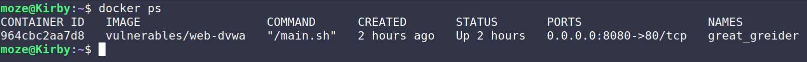

# Fuzzing

## WebApp Fuzzing

- **Installing `ffuf`:**

  I downloaded pre-built binary for `ffuf` and added it to my machine:
  

- **Running the app:**

  

- **Fuzzing:**

  In the upcoming tasks 4 main flags were used to perform the fuzzing:

  1. `-u`: This flag is used to specify the target URL.
  2. `-w`: This flag is used to specify the Wordlist file we're going to use.
  3. `-r`: This flag is used to follow redirects _(3xx HTTP response status codes)_.

  ***

  - **Accessible endpoints/files:**

    

    From the report we can see that we got multiple status codes, and that we have redirection status codes.
    We can use the flag `-r` in `ffuf` to deal with those responses.

    

    From the report we can see we got:

    - **5 accessible endpoints/files:** config, docs, external, favicon.ico and robots.txt
    - **3 unaccessible endpoints/files:** .htaccess, .htpasswd and server-status

  - **Extensions available for the `index` page:**

    

    From the report we can see we got:

    - **1 available extension:** .php
    - **1 unavailable extension:** .phps

  - **Accessible directories:**

    

    From the report we can see we got:

    - **3 accessible directories:** docs, config and external
    - **1 unaccessible directory:** server-status

  In the reports before we can notice that we had 2 main HTTP response status codes:

  1. [`200`:](https://developer.mozilla.org/en-US/docs/Web/HTTP/Reference/Status/200) successful response status code indicates that a request has succeeded.
  2. [`403`:](https://developer.mozilla.org/en-US/docs/Web/HTTP/Reference/Status/403) client error response status code indicates that the server understood the request but refused to process it.

## Python Fuzzing

- **Installing AFL++ locally & preparing input:**

  

- **Running the fuzzer:**

  
  

- **Results analysis:**

  - `fuzzer_status`:
    

  - Input that caused crashes:
    

  - Input that caused hangs:
    

- **Reproducing the problems:**

  - **Crash:**
    

  - **Hang:**
    

- **Explanation and solution:**

  - **Crash:**

    <ins>Problem:</ins> The crash happened because a char out of the base 16 was in the input, leading to a problem converting it.

    <ins>Solution:</ins> Write an exception to deal with unfamiliar chars.

  - **Hang:**

    <ins>Problem:</ins> The hang happened because in the case where the string starts with a `+` the `i` is not being modified, leading to getting stuck in an infinite loop.

    <ins>Solution:</ins> Modifying `i` after appending `' '`.

- **Questions:**

  1. Will the fuzzer ever terminate in the above experiment? Why/Why not?

     By default the fuzzer won't stop until it gets stopped manually since it keeps generating input and testing the app.
     We can set it to stop at certain events, like finding a crash or processing a certain number of queue using [environment variables](https://aflplus.plus/docs/env_variables/) like: `AFL_BENCH_JUST_ONE` causes the fuzzer to exit after processing the first queue entry.

  2. How coverage-guided fuzzers work? Is AFL coverage-guided?

     Coverage-guided fuzzing sends random input to an instrumented version of the app we are testing and see if produces any unexpected behaviors. And because of that AFL is considered to be coverage-guided.

     References:

     - [Coverage guided vs blackbox fuzzing](https://google.github.io/clusterfuzz/reference/coverage-guided-vs-blackbox/)
     - [What is AFL and What is it Good for?](https://github.com/google/fuzzing/blob/master/docs/afl-based-fuzzers-overview.md)

  3. How to optimize a fuzzing campaign?

     We can do that by utilizing other tools to check for vulnerabilities in the app like memory problems. We can also write small, valid, and diverse input to help discover code paths quicker.
