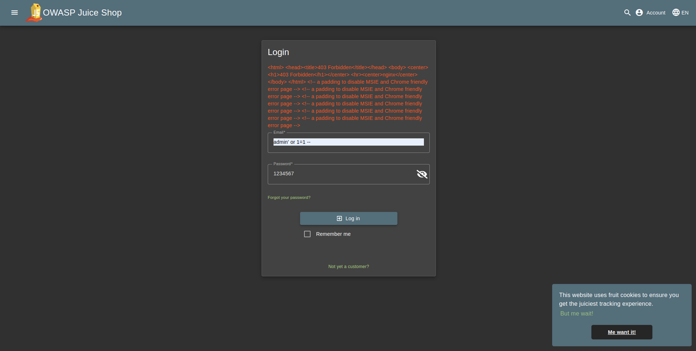

# Web Application Firewall (WAF)

## Blocking SQLi with WAF

### Setting up Juice-Shop

After pulling the [image](https://hub.docker.com/r/bkimminich/juice-shop) from DockerHub, we run:

```bash
docker run --rm -p 3000:3000 bkimminich/juice-shop
```


### Login as admin with SQLi

This can be done by using a simple SQL injection in the email field:

```
admin' or 1=1 --
```


### Deploying `owasp/modsecurity-crs`

We create a simple docker compose to run both apps on the same network:
```yaml
networks:
  web-app-firewall:

services:
  app:
    image: "bkimminich/juice-shop"
    container_name: "juice-shop"
    ports:
      - "3000:3000"
    networks:
      - web-app-firewall

  waf:
    image: "owasp/modsecurity-crs:nginx"
    container_name: "CRS"
    ports:
      - "8080:8080"
    environment:
      - BACKEND=http://app:3000
    networks:
      - web-app-firewall
```
___
**[CRS environment variable](https://github.com/coreruleset/modsecurity-crs-docker/blob/main/README.md#common-env-variables):**
- `BACKEND`: Partial URL for the remote server of the ProxyPass (httpd) and proxy_pass (nginx) directives
___

Now we can access the app by visiting `http://localhost:8080`


### Trying the previous SQL injection with a WAF on




## Bypassing WAF

### Updated exploit

We can try using `\` to prevent the WAF from detecting the payload

```
admin\' or 1=1 --
```


### Setting a custom rule to block the exploit

To set a new custom rule, we have to access the docker container and add a new configuration file.


Now we can add the new rule `patch-SQLi.conf` by mounting it to our container in our docker compose and restarting apps.

- `patch-SQLi.conf`:
    ```conf
    SecRule REQUEST_URI|ARGS|ARGS_NAMES|REQUEST_HEADERS|REQUEST_BODY "@rx (?i:(\\\\'|%5[cC]%27)\s*(or|and|union|select|insert|group|having|benchmark|sleep)\b)" \
    "id:900102,\
    phase:2,\
    deny,\
    status:403,\
    log,\
    msg:'SQLi detected: backslash-escaped quote followed by SQL keyword',\
    severity:'CRITICAL',\
    tag:'attack-sqli',\
    tag:'paranoia-level/1',\
    t:none,t:urlDecodeUni"
    ```

- Updated `docker-compose.yml`:
    ```yaml
    networks:
    web-app-firewall:

    services:
    app:
        image: "bkimminich/juice-shop"
        container_name: "juice-shop"
        ports:
        - "3000:3000"
        networks:
        - web-app-firewall

    waf:
        image: "owasp/modsecurity-crs:nginx"
        container_name: "CRS"
        ports:
        - "8080:8080"
        environment:
        - BACKEND=http://app:3000
        volumes:
        - ./patch-SQLi.conf:/etc/modsecurity.d/owasp-crs/rules/patch-SQLi.conf
        networks:
        - web-app-firewall
    ```

If we try to log in now:


### Automated SQLi test

To automate SQL injection test, we can use `sqlmap`:

```bash
sqlmap -u "http://localhost:8080/login" --data="email=test@example.com&password=test" --batch --level=5 --risk=3 --random-agent -v 3 --ignore-code 401
```
- `data="email=test@example.com&password=test"`: Target the email and password parameters.

- `batch`: Run non-interactively, accepting default answers.

- `level=5` & `risk=3`: Perform an exhaustive scan using the most aggressive tests.

- `random-agent`: Randomize the user agent to mimic different browsers.

- `v 3`: Output detailed information during the scan.

- `ignore-code 401`: Ignore HTTP 401 responses to ensure testing continues regardless of authorization issues.

**`sqlmap` findings:**


From the report we can see that even with exhaustive scanning, all the injection tests that sqlmap did failed. It also says that the host doesn't seem to be injectable.\
This indicates that the WAF we're using is blocking all the attempts to inject and gain access to Juice Shop.